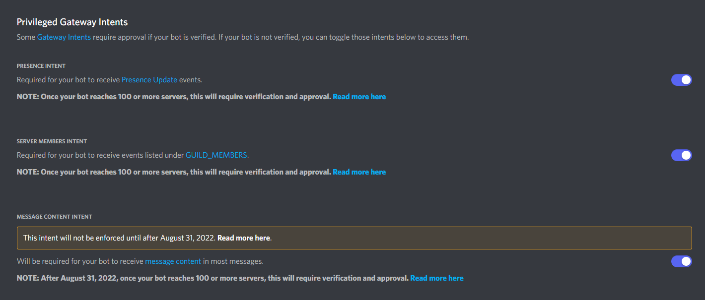

# Mango Pi

Moderation Discord bot made with Discord.py, MongoDB, and Lavalink.

---
### Software Requirements

### Python Module Requirements
* Discord.py
* PyMongo
* requests
* pytz
* pyyaml
* wavelink
### [Lavalink](https://github.com/freyacodes/Lavalink)
* Download the jar file and put it in the main directory of the bot
---
### Features
* Anti-Raid
* Reminder
* Timed Mute
* Temporary Bans (Timed Ban)
* Warn System
* Message Scanner (Auto-Mod for Banned Words)
* Role Menu
* Basic Music Player
---
### Instructions
1. **Be sure all software requirements are fulfilled**
    1. If you wish to run the bot on your local machine, then you will need to install MongoDB Community edition.
    2. If you already have a MongoDB server working else where, just simply edit `Bot Settings/keys.json` on "DB-address"
    3. Download Lavalink.jar from the link provided above and put it in the bot directory (where Main.py is located)

2. **[Discord Developer Portal](https://discord.com/developers)**
    1. Go to the link above and ensure you have the following options on under the **Bot** section of your application
    
    2. You can find your bot token at the top of the page as well

3. **Check out Bot Settings/keys.json and edit the file as you see fit**
    1. "token": followed by your bot token in parentheses
    2. "prefix": followed by your default prefix of choice for the bot in parentheses
    3. "DB-address": followed by your MongoDB access URL in parentheses
        1. default for MongoDB localhost is `"mongodb://localhost:27017/"`
    4. "DB-cluster": followed by MongoDB cluster of choice in parentheses

4. **Run the bot either by double click or by console command `py Main.py`**
    1. it is possible to run Main.py right after software requirement is fulfilled, however, it is recommended to fulfill the Module requirement beforehand as well
    2. You may encounter error after bot termination via `Ctrl + C`, however, it is safe to ignore that error (it should say something similar to `RunTimeError: Event loop is closed`)
---

## License
[MIT](https://choosealicense.com/licenses/mit/)
